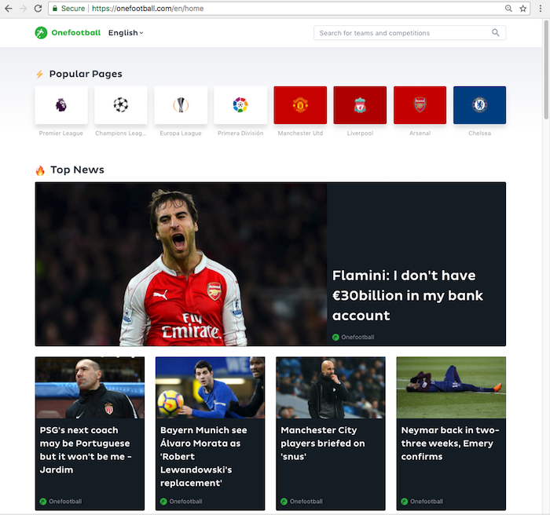
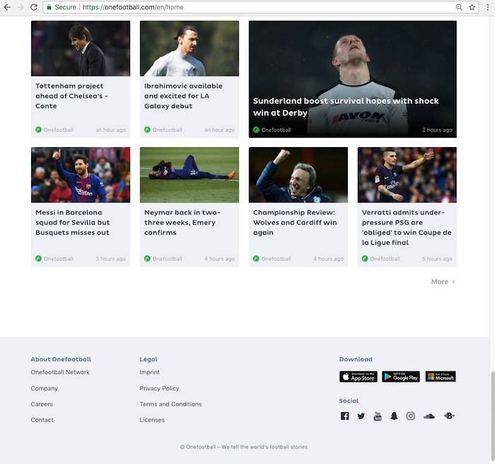
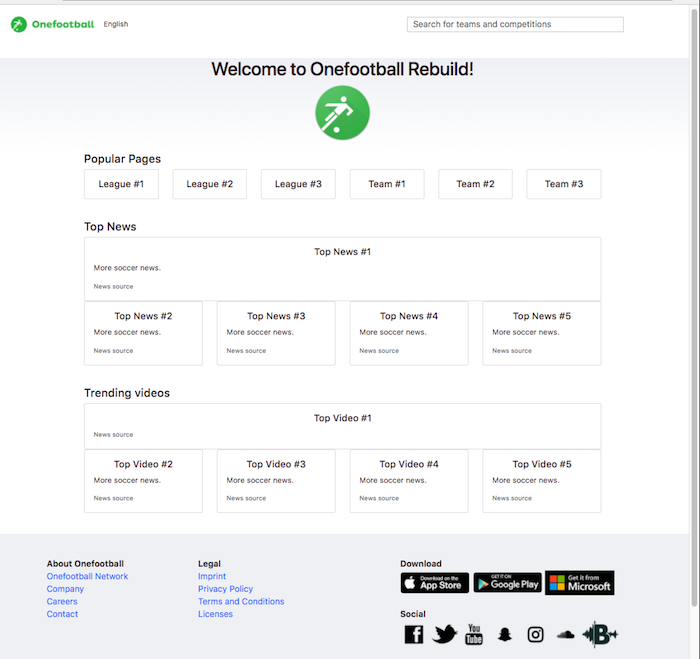

# rebuild-onefootball

### by Ron Craig (ron.craig@comcast.net)
#### 03/30/2018-04/08/2018

### GitHub repository: https://github.com/r-craig73/rebuild-onefootball

### Original site
#### Top main page...
<kbd></kbd>
#### Bottom main page...
<kbd></kbd>

### Rebuild site (updated: 04/01/2018 evening)
<kbd></kbd>

## Description
### A project rebuilding onefootball.com English (http://onefootball.com/en/home) using angular.
### Week 1: build functionality, week 2: add a database and deploy online

## Specifications

| Spec   | Status   |
|--------|:-------: |
| Generate functioning header <app-app-head></app-app-head> components. | Ongoing |
| Generate functioning news <app-news></app-news> components. | Ongoing |
| Generate functional footer <app-footer></app-footer> components. | Completed |
| Match Onefootball text and background styling. | Ongoing |
| Generate functional popular pages, news and trending soccer videos links and/or API calls. | Ongoing |

## Tasks to Complete
[ ] Use bootstrap Card to edit news blocks.
[ ] Use either bootstrap Input group or unique button type to replicate a magnifying glass icon.
[x] Use bootstrap 4 to dropdown languages.


## Technologies Used
```
Application: Angular CLI [Angular CLI] (https://github.com/angular/angular-cli) version 1.7.3, JavaScript, jQuery, Bootstrap, HTML
Testing: Angular, Jasmine, Karma
Environment: ng, npm, webpack, babel, esLint
```

## Angular Installation Setup

### Development server

Run `ng serve` for a dev server. Navigate to `http://localhost:4200/`. The app will automatically reload if you change any of the source files.

### Code scaffolding

Run `ng generate component component-name` to generate a new component. You can also use `ng generate directive|pipe|service|class|guard|interface|enum|module`.

### Build

Run `ng build` to build the project. The build artifacts will be stored in the `dist/` directory. Use the `-prod` flag for a production build.

### Running unit tests

Run `ng test` to execute the unit tests via [Karma](https://karma-runner.github.io).

### Running end-to-end tests

Run `ng e2e` to execute the end-to-end tests via [Protractor](http://www.protractortest.org/).

### Further help

To get more help on the Angular CLI use `ng help` or go check out the [Angular CLI README](https://github.com/angular/angular-cli/blob/master/README.md).

## Known Bugs and Issues
* Header: Use search for news and/or video API calls.
* News and videos: Link to soccer articles and/or videos.

MIT License
-----------

Copyright (c) 2018 **_RC productions_**

Permission is hereby granted, free of charge, to any person obtaining a copy of this software and associated documentation files (the "Software"), to deal in the Software without restriction, including without limitation the rights to use, copy, modify, merge, publish, distribute, sublicense, and/or sell copies of the Software, and to permit persons to whom the Software is furnished to do so, subject to the following conditions:

The above copyright notice and this permission notice shall be included in all copies or substantial portions of the Software.

THE SOFTWARE IS PROVIDED "AS IS", WITHOUT WARRANTY OF ANY KIND, EXPRESS OR
IMPLIED, INCLUDING BUT NOT LIMITED TO THE WARRANTIES OF MERCHANTABILITY,
FITNESS FOR A PARTICULAR PURPOSE AND NONINFRINGEMENT. IN NO EVENT SHALL THE AUTHORS OR COPYRIGHT HOLDERS BE LIABLE FOR ANY CLAIM, DAMAGES OR OTHER
LIABILITY, WHETHER IN AN ACTION OF CONTRACT, TORT OR OTHERWISE, ARISING FROM, OUT OF OR IN CONNECTION WITH THE SOFTWARE OR THE USE OR OTHER DEALINGS IN THE SOFTWARE.
